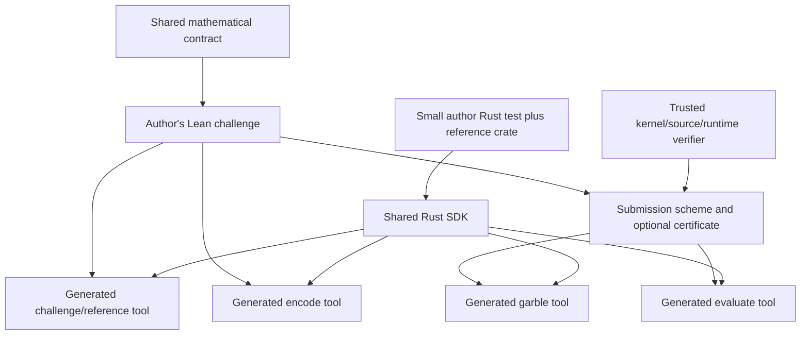

# SecretRelease: current map and executable challenge design

Source baseline: `bb781e3`, reviewed 2026-09-06. The architecture below is a
proposal, not an already implemented generic runtime. The approved resource
change is implemented separately: 8 GiB CI builds, 4 GiB local builds, 1 GiB
native checks. No security predicate changes as part of that resource change.

The intended author experience is a small Lean challenge definition plus Rust
tests using an independent reference implementation. Authors should not write
Lean I/O entrypoints, binary parsers for standard disclosures, process-spawning
code, a verifier, or individual CI workflows. The library generates the tools;
the Rust SDK calls and tests them.

## Current shared contract

[`SecretRelease.lean`](SecretRelease.lean) is 276 physical lines including
comments and blank lines. It has these responsibilities:

| Part | Present contract |
| --- | --- |
| Fixed values | `Bytes n`, 32-byte `Label`, `Hash`, and VCVio oracle programs |
| Canonical input/private encoding | `Codec`: fixed bit width, encode/decode, both round trips; checked subtypes represent validity |
| Disclosure | Finite nonempty key space and `reveal hash keys value → bytes` |
| Built-in mechanisms | Lamport, HORS, OnesOnly, Preimage, Plain |
| ROM profile | Fixed query cap, rational error function, proof it remains below one |
| Challenge | Private/Input/Output types, codecs, disclosures, reference, forbidden claims, optional withholding and private leakage |
| Candidate algorithms | Artifact type, coins, garble, artifact serialization/deserialization, evaluate |
| Correctness and size | Correctness through serialized evaluation; universal artifact byte bound |
| Security games | Independent uniform keys/coins/shared oracle; known-input views; post-release recovery, optional withholding, equal-leakage private-map privacy |
| Certification | Exact/statistical correctness, codec laws, byte bound, every enabled security obligation |
| Optional size threshold | `SizeAccepted` fixes an author-chosen cap |

`SecretRelease/Examples.lean` is 40 lines of declaration helpers and a ROM bound.
`SecretRelease/Simulation.lean` is a 19-line import facade for VCVio simulation
and cost infrastructure. It does not add simulation security to `Certified`.
Generic sampling/nonvacuity/axiom audits and native disclosure checks live in
`SecretReleaseTests/`, outside the contract.

The current core already permits arbitrary artifact representations, arbitrary
algorithms, custom finite key spaces, and hash-dependent disclosures. It does
not prescribe gates, free-XOR, half-gates, or field pads.

The initial profile really is a restriction: it permits unlimited local
computation and does not supply a computational-hardness assumption for PRFs,
AES, or lattices. Additional reviewed computational profiles need their own
adversary/cost model. The runtime framework should not make that future extension
harder by putting SHA-256 or a specific construction into the mathematical rule.

It does **not** provide executable key codecs, a generic byte interface for
all codecs, a concrete hash backend, a generic CLI, a Rust SDK, uniform runtime
key generation, or automatic four-tool packaging. A `Finite` instance is not
an executable key serializer or sampler. `Codec.encode` produces bits, while
`Scheme.encode` serializes an artifact; neither is the requested input-label
`encode` command.

## Current challenges

| Property | BLAKE3 | G1 release |
| --- | --- | --- |
| Acceptance | Separate `Blake3Prize.Protected.CertifiedScheme` | Direct `SecretRelease.Certified challenge` |
| Reference | Clean's BLAKE3 compression, specialized to ordinary 64-byte hash | Existing BN254 group: `Q + [r]A` |
| Private parameters | None | Canonical Q including infinity, canonical r |
| Evaluator's known input | 64-byte message, 512 bits | Valid finite-affine A, 64 bytes / 512 bits |
| Input disclosure | 512 distinct uniform Lamport pairs; selected labels | Same |
| Output disclosure | 256 selected digest-bit labels | Canonical plaintext point, 65 bytes including infinity |
| Post-release claim | Recover any opposite input/output label | Recover any opposite input label |
| Private-map privacy | None needed | Compare private maps with equal result at A |
| Withholding | Not required by accepted predicate | Not enabled |
| Correctness | Exact | Exact |
| ROM bound | `(q+1)/2^128`, `q ≤ 2^64` | Same |
| Current candidate | `none` | `none` |
| Runtime hash | Clean's pure Lean SHA-256 | Trusted portable C SHA-256 |
| Current executable | One binary with `describe`, `garble`, `evaluate` | Same |
| Input-label encode tool | Missing; test scripts select labels | Missing; test scripts select labels |
| Reference tests | Lean native executable + Python reference | Lean native executable + Python arithmetic |
| Automatic binary export | No common packager | Verifier exports `g1-release` binary and report |

BLAKE3's separate shared-contract **example** has an additional pre-release
withholding requirement. It is not equivalent to the current acceptance
predicate. Migration must preserve the accepted post-release game by default;
adding withholding is a separate explicit security decision.

There is also a type-level migration detail: legacy BLAKE3 accepts arbitrary
pair functions and places distinctness hypotheses on correctness, while its
byte bound quantifies over all pairs. The shared key type contains only distinct
pairs. Adapters must account for this difference as well as the probability law;
preserving admissible behavior is not a one-line import replacement.

BLAKE3 duplicates 254 lines of contract/game code across `Core`, `SecretRelease`,
`ROM`, and `Target`. Its 59-line reference adapter remains challenge-specific.
G1's `Target` is 62 lines including its challenge and mathematical connection
lemmas; its 169-line codec module proves canonical coordinates, point tags,
scalar bounds, and bit/byte transport. These math/codec proofs are substantive.

BLAKE3 has 82 lines of runner code; G1 has 74. Verifier drivers are 186 and
147 lines respectively, with additional policy, resource, and test scripts.
G1 already reuses some BLAKE3 host helpers, but neither uses a common verifier
configuration or a common binary interface.

Both complete entries are absent. BLAKE3's 707,680-byte half-gates measurement
and the old G1 5,940,480-byte ideal-pad result are not shared-ROM certificates.
The original root G1 challenge remains separate from `g1-release`.

## Proposed ownership and data flow



The author supplies the mathematical reference, validity, codecs, disclosures,
and security choices. A Rust crate supplies an independent executable reference;
it cannot replace the Lean specification or secrecy theorem. A suitable existing
crate usually avoids another handwritten arithmetic/hash implementation.

The shared library supplies serialization conventions, standard disclosure key
codecs, pure tool adapters, I/O, process/resource management, fixtures, reporting,
and Lake/CI packaging. It should ship one Rust crate for these operations.

## Keep the mathematical contract small

Keep one readable mathematical contract file, approximately its present size.
The large saving comes from deleting challenge-specific duplicates and moving
runtime plumbing into a reusable implementation. Adding tested CLI/SDK support
will initially add total library code. A smaller total line count is not a
credible promise before that implementation exists.

A practical target is 20–50 lines to declare a typical challenge once its
reference and codecs exist, a few manifest entries for dependencies/module
names, and a short Rust reference test. Bespoke mathematical codecs still need
proofs. The measured 254-line duplicate BLAKE3 contract and 156 combined runner
lines are opportunities for consolidation, not a guaranteed net deletion count.

Suggested layout:

```text
secret-release/
  SecretRelease.lean              # definitions and acceptance predicates
  SecretRelease/Encoding.lean     # canonical byte adapters and built-in key codecs
  SecretRelease/Runtime.lean      # pure adapters tied to the contract
  SecretRelease/CLI.lean          # common I/O and tool dispatch
  SecretRelease/NativeHash.lean   # explicit trusted SHA-256 boundary
  SecretRelease/Lake.lean         # common build registration
  native/sha256.c
  scripts/                       # one verifier, source policy, quotas, packager
  rust/secret-release/            # process and wire-format SDK
```

These modules contain the transport laws needed to connect bytes to typed Lean
values. Garbling/security reductions remain in submissions or separate libraries.
The core need not import I/O, C primitives, or Rust.

## Runtime information that is missing

Add a small executable descriptor alongside each mathematical `Challenge`:

- Canonical byte serialization for `inputs.Keys` and `outputs.Keys`. Built-in
  disclosure constructors supply these automatically; custom key spaces provide
  their codecs and round-trip proofs.
- Canonical bytes for private/input values derived from their existing bit
  codecs: declared length, LSB-first packing, and rejection of nonzero unused
  padding bits. Non-byte-aligned widths must work too.
- Optional serialization of the full reference value for independent Rust
  comparison. Built-in Lamport/Plain constructors should normally supply it.
  Arbitrary custom disclosures may expose only their existing released bytes;
  do not require all possible `Output` types to have a fixed-width encoding.
- Tool/wire version and immutable challenge identity, disclosure metadata, and
  runtime primitive profile. Custom disclosures stay an extension point;
  correctness must never depend on a Rust enum recognizing every future scheme.

A sketch, not compiled API:

```lean
structure ExecutableChallenge where
  spec : Challenge
  wire : WireFormat spec
```

Wire formats are protected author/library choices. The submission keeps complete
control over the artifact codec. Avoid an obligatory artifact header; any header
actually needed by the evaluator must be included in the scored bytes.

## Generated tools

Every package has three usable tool entrypoints plus an automatically generated
challenge/reference tool. The author writes none of their `main` functions.

| Tool | Inputs | Output | Ownership |
| --- | --- | --- | --- |
| `garble` | Coins, private value, input keys, output keys | Complete serialized artifact | Runs submission's exact scheme |
| `encode` | Canonical plaintext input and input keys | Known input plus selected input disclosure | Runs protected codec and `inputs.reveal` |
| `evaluate` | Artifact and encoded evaluation input | Released output bytes | Runs submission's exact serialized evaluator |
| `challenge` | Reference/check command and its explicitly required values | Reference value/disclosure, codec checks, metadata | Entirely generated from protected specification |

The input-label `encode` tool is construction-independent. It must call
`inputs.reveal`; a Lamport-only implementation would exclude HORS, OnesOnly,
Preimage, and future custom hash-dependent releases. It receives neither the
private parameters nor output keys. `garble` receives **no plaintext input A**.
`evaluate` receives neither complete key sets nor private parameters.

Use a common envelope for known input plus active disclosure, or fixed separate
files managed by the SDK. This transport is outside the artifact score only
because those exact channels are already declared by the challenge. Report
channel bytes separately; no extra instance data may be hidden there.

The pure adapters need equations connecting the generated operations to
`garbleBytes`, `inputs.reveal`, `evaluateBytes`, and `outputs.reveal (reference …)`.
The byte round trips must justify decoding, bit order, and invalid-shape rejection.
Keep standard codec derivations in the library so authors do not repeat them.

## Always testable, separately certified

Today both submission entrypoints are `Option CertifiedScheme`; without a
certificate their garble/evaluate path is disabled. That prevents ordinary
binary testing of incomplete candidates.

Separate the executable scheme from the optional certificate. Conceptually:

```lean
structure Candidate (c : Challenge) where
  scheme : Scheme c
  claimedBytes : Nat
  certificate : Option (Certificate scheme claimedBytes)
```

`Certificate` here is a proposed type containing the existing proof fields,
indexed by the exact scheme and byte bound. It adds no assumptions and removes
no secrecy obligations. An entry may still be absent when no implementation
exists; generated tools then report that explicit state. Tool generation cannot
invent a garbler from a reference function.

An implemented candidate can run every binary/test while its certificate is
absent. Its report says `uncertified` and has no accepted score. A certificate
can later be attached without changing the executable API. Trusted ranking
still requires the complete kernel-audited certificate, source policy, verified
build provenance, and successful binary tests. Test success cannot become a
security assumption.

Distinguish missing implementation, runnable uncertified candidate, and certified
candidate in machine-readable metadata. Authoring previews remain non-ranking
regardless of the candidate state. Generate score metadata from the audited
entry; a separate hand-edited `score.txt` can eventually become a compatibility
output rather than another author responsibility.

## Shared Rust SDK and tests

Provide a `secret-release` Rust crate that loads a built tool bundle and owns:
process invocation, temporary files, role-specific inputs, exit/error handling,
wire formats, selected-label helpers, deterministic test fixtures, time/RSS
limits, byte measurements, binary hashes, and certificate-status reporting.
Build Rust tests with `cargo test --no-run --locked --jobs 1` under the build
budget, then execute the produced test binaries with one test thread under the
native budget. Spawned tools count toward that same aggregate native limit;
running `cargo test` wholesale under the larger build cap would miss this distinction.

A proposed author test could look like this (SDK API is illustrative):

```rust
#[test]
fn blake3_release() -> secret_release::Result<()> {
    let challenge = secret_release::Bundle::from_env()?;
    let message = [42u8; 64];
    let fixture = challenge.test_fixture(&[], &message, 7)?;
    let expected = blake3::hash(&message);
    challenge.assert_case(&fixture, expected.as_bytes())
}
```

The official [BLAKE3 Rust crate](https://github.com/BLAKE3-team/BLAKE3#the-blake3-crate)
provides that reference hash. Pin it in the test workspace's lockfile. A BN254
test uses an independent curve implementation and a small adapter for our exact
little-endian coordinates, infinity tag, and scalar format; matching a curve
name does not imply matching serialization conventions.

`assert_case` should first compare the Rust reference bytes with the generated
Lean reference tool, then run `garble → encode → evaluate`, derive the expected
output disclosure from the independently computed reference value and supplied
output keys, and compare exact output bytes. Plain outputs compare directly;
Lamport outputs compare the selected label bytes, not the plaintext digest.
For a custom output without a full value codec, the author can provide expected
released bytes instead of forcing an extra encoding restriction on the contract.

Generic tests cover codec round trips, short/long/noncanonical inputs, selected
labels, shared-oracle determinism, exact artifact measurement, and metadata.
Challenge-specific Rust cases cover independent functional behavior and valid
input generation. BLAKE3 gets message patterns and official vectors; G1 gets
zero/max scalars, random valid points, infinity outputs, and cancellation.

Reject malformed encodings required by the protected codec. Do not universally
require every construction to authenticate arbitrary wrong active labels: that
is not an existing correctness requirement. Additional rejection tests must be
justified by the declared interface or tested as properties of specific fixtures.

Deterministically seeded test fixtures are not production key generation or a
proof of the uniform security law. Built-in key-generation helpers can use an
explicit OS-CSPRNG implementation profile; custom finite spaces need their own
sampling implementation and justification. `Finite Keys` alone supplies neither
an efficient sampler nor a proof that a concrete generator has the required law.

## Packaging and trust

One shared build command generates all entrypoints from fixed, protected module
names and emits a bundle with tools plus a manifest: challenge/source/dependency
hashes, wire version, native primitive, certificate status, claimed/certified
bound, and each binary's hash. No instance may specialize the free executable
with private data. All instance-dependent public evaluator data remain scored.
The fixed executable bundle has a separately reported download/disk size; it is
not the per-instance garbling score. Share compiled dependency objects across
entrypoints so generating four tools does not rebuild their proof dependencies
four times.

The Rust test executable is built automatically by Cargo from the small author
tests. A single shared CI workflow verifies and tests each configured challenge
and publishes its bundle. Candidate PRs cannot replace that workflow, descriptor,
reference tests, source policy, Rust SDK, dependency pins, or expected digest.
The immutable-base overlay remains the trust anchor.

Use trusted C SHA-256 as the initial common runtime profile, preserving the
ideal-ROM/implementation distinction. A Rust reference library is a test oracle,
not an additional axiom in Lean. Compiler/FFI trust and the heuristic SHA-256
instantiation remain explicit in bundle metadata.

## Implementation order and feasibility

1. Apply the approved 8 GiB CI cap, keeping local and native caps unchanged.
2. Add canonical byte/key codecs and the executable descriptor. Test Lamport,
   HORS, OnesOnly, Preimage, Plain, and a custom disclosure without assuming
   every disclosure has a constant active-byte length.
3. Separate candidate execution from certification; generate the three tools
   and the shared challenge/reference tool. Verify their pure adapter laws.
4. Add the Rust SDK and migrate existing G1 native/Python fixture tests to it.
5. Migrate BLAKE3 acceptance to the shared contract. Prove the bit/label/view and
   probability-law correspondence; do not silently add the example's withholding
   goal. Attach the existing baseline as runnable but uncertified.
6. Consolidate verifier/Lake/CI configuration and delete superseded per-challenge
   runners and scripts only after equivalent checks pass.

There is no fundamental blocker to this architecture. The delicate work is
canonical codec transport, preserving BLAKE3's actual game during migration,
handling custom disclosures, and keeping executable tests distinct from proof
certification. G1 math codecs and an independent Rust curve encoding adapter
remain real author work when no reusable codec exists.

The shared core can stay small; each additional challenge should mostly add its
mathematics and reference tests. Generating binaries is manageable infrastructure
work and does not establish the missing finite-key ROM proofs for either baseline.
